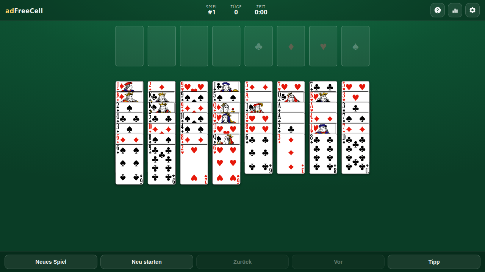
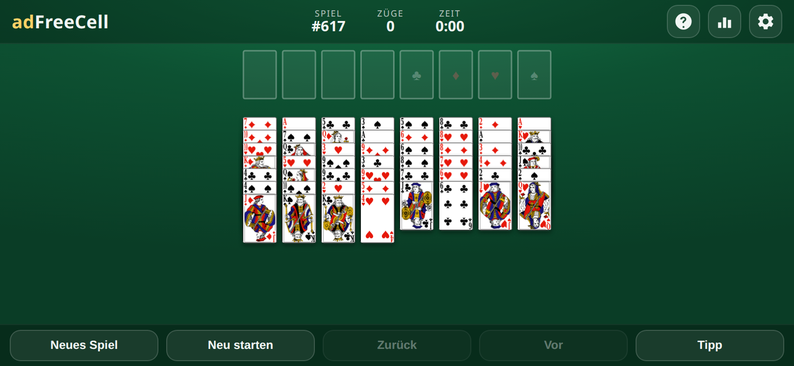

# adFreeCell ♠️♥️♦️♣️

Classic **FreeCell** solitaire as a single, self-contained HTML5 game — with
**no ads, no trackers and no nonsense**. It uses the same game numbers as the
original Windows FreeCell (so *Game #617* is the same board for everyone),
plays offline, installs as an app, and is built mobile-first for phones and
tablets while looking great on widescreen.

**No build step, no dependencies, no internet.** Just open `index.html`.

<p align="center">
  
</p>
<p align="center">
  
</p>

## ▶️ Play online

**→ https://laserrapt0r.github.io/adFreeCell/**

The game is deployed automatically to GitHub Pages on every push to `main`
(see [`.github/workflows/deploy-pages.yml`](.github/workflows/deploy-pages.yml)).

## 📱 Install as an app (PWA)

adFreeCell is a Progressive Web App. Open it in a browser and choose
**“Install” / “Add to Home Screen”** (or use the **Install app** button in
Settings when your browser offers it). It then runs full-screen and works
completely offline, thanks to a service worker that caches the whole game.

---

## Features

- **Authentic FreeCell rules.** 8 tableau columns, 4 free cells, 4 foundations.
  Build the tableau down in alternating colours; build the foundations up by
  suit from Ace to King.
- **The original game numbers.** Deals are generated with Microsoft's classic
  shuffle, so game numbers **1–32000 reproduce the exact same boards** as the
  Windows FreeCell you remember. Pick a number, share a number, replay a number.
- **Guaranteed-solvable random games.** “New game” picks a random solvable deal
  (only the famously unsolvable **#11982** is skipped).
- **Supermoves.** Move a valid run of cards in one gesture, limited by the real
  FreeCell formula: *(1 + free cells) × 2^(empty columns)* — the game never lets
  you do something you couldn't do one card at a time.
- **Two ways to play:** drag-and-drop, or tap-to-select then tap-to-place.
  Double-tap (or tap a selected card again) sends it straight home.
- **Auto-collect & auto-finish.** Safe cards fly to the foundations
  automatically (toggleable), and once a game is unblockable it finishes itself.
- **Undo / redo / restart** and an optimal-ish **hint**.
- **Statistics:** games played and won, win rate, current & best streak, best
  time and fewest moves — stored locally.
- **Made for every screen.** A fluid **landscape** layout scales from small
  phones to tablets and widescreen desktops; card size and fan spacing are
  computed to always fit without scrolling. Held in portrait, a touch device
  shows a friendly “rotate your device” hint (FreeCell wants the width).
- **Three table themes:** Felt, Midnight and Slate.
- **5 languages:** German, English, Spanish, French and Italian (auto-detected).
- **Synthesized sound** via the Web Audio API — no audio files, works offline.
- **Beautiful cards** from the well-known LGPL **SVG-cards** set (crisp at any
  size).

---

## How to play

1. Open `index.html` in any modern browser — or visit the
   [online version](https://laserrapt0r.github.io/adFreeCell/).
2. Move every card onto the four **foundations** (top right), by suit, from Ace
   up to King.
3. In the **tableau** you build **down in alternating colours** (a red 6 goes on
   a black 7).
4. The four **free cells** (top left) each hold a single card as temporary
   storage.
5. Win by getting all 52 cards home. Fewer moves and less time make better
   statistics.

Tip: `?game=617` in the URL opens that specific game number directly.

Keyboard: **U** undo · **Ctrl/⌘+Z** undo · **Ctrl/⌘+Shift+Z** redo · **H** hint ·
**N** new game.

---

## Project structure

```
adFreeCell/
├── index.html                 # Game shell / markup
├── manifest.webmanifest       # PWA manifest
├── sw.js                      # Service worker (offline cache)
├── privacy.html               # Privacy policy (no data collected)
├── css/
│   └── style.css              # Styling, themes, responsive layout
├── icons/                     # App icons (SVG + generated PNGs)
├── assets/
│   └── svg-cards.svg          # Pristine LGPL card artwork (source)
├── js/
│   ├── cards-sprite.js        # The card artwork embedded for offline use
│   ├── deal.js                # Card model + Microsoft FreeCell deal
│   ├── engine.js              # Pure FreeCell rules engine (no DOM)
│   ├── storage.js             # Settings, stats & resume (localStorage)
│   ├── i18n.js                # de / en / es / fr / it strings
│   ├── audio.js               # Web Audio sound effects
│   └── game.js                # Rendering, input and game flow
├── tools/
│   └── test.js                # Self-test (deal, rules, solvability)
├── .github/workflows/
│   └── deploy-pages.yml        # GitHub Pages deployment
├── LICENSES/
│   ├── LGPL-2.1.txt            # License for the card artwork
│   └── CARDS-NOTICE.md         # Card attribution & compliance notes
├── LICENSE                     # MIT license for the game code
├── .gitignore
└── README.md
```

---

## Tech

Vanilla JavaScript, the DOM and inline SVG, plus the Web Audio API and a service
worker. No frameworks, no external network requests — the whole game runs from
the local files. The rules engine ([`js/engine.js`](js/engine.js)) is pure and
DOM-free, and the deal ([`js/deal.js`](js/deal.js)) is verified to reproduce
Windows FreeCell **Game #1** exactly.

### Testing

```bash
node tools/test.js
```

runs (with no dependencies) the deal verification, the rules-engine unit tests,
and a search that solves several games *through the engine* to confirm the rules
permit a full legal path to a win.

## 🤖 Android app

The game is structured to be wrapped as an Android app later (e.g. via a Trusted
Web Activity or a WebView shell pointing at these static assets). Signing
keystores (`*.jks`) and build outputs (`*.aab`, `*.apk`) are intentionally
git-ignored and must never be committed.

---

## License

This project has **two** licenses:

- **Game code** (HTML, CSS, JS, icons and original assets): **MIT** — see
  [`LICENSE`](LICENSE).
- **Playing-card artwork** (`assets/svg-cards.svg`, embedded in
  `js/cards-sprite.js`): the **SVG-cards** set by David Bellot (fork by
  htdebeer), licensed under **LGPL-2.1** — see
  [`LICENSES/CARDS-NOTICE.md`](LICENSES/CARDS-NOTICE.md) and
  [`LICENSES/LGPL-2.1.txt`](LICENSES/LGPL-2.1.txt).

If you fork or redistribute adFreeCell, keep `assets/svg-cards.svg`, the cards
notice and the LGPL text in place.

## Credits

- Playing cards: **SVG-cards** — David Bellot & htdebeer
  (<https://github.com/htdebeer/SVG-cards>).
- FreeCell was designed by **Paul Alfille**; the numbered-deal shuffle follows
  Microsoft's classic implementation.
